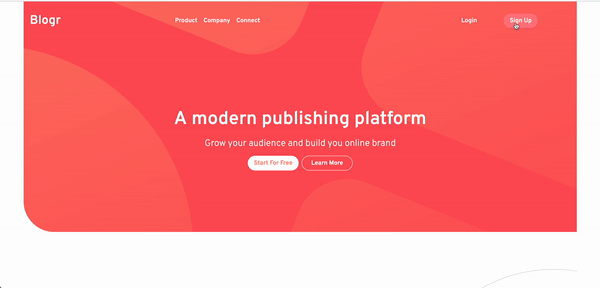

# Frontend Mentor - Blogr landing page solution

This is a solution to the [Blogr landing page challenge on Frontend Mentor](https://www.frontendmentor.io/challenges/blogr-landing-page-EX2RLAApP). Frontend Mentor challenges help you improve your coding skills by building realistic projects.

## Table of contents

- [Frontend Mentor - Blogr landing page solution](#frontend-mentor---blogr-landing-page-solution)
  - [Table of contents](#table-of-contents)
  - [Overview](#overview)
    - [The challenge](#the-challenge)
    - [Screenshot](#screenshot)
    - [Links](#links)
  - [My process](#my-process)
    - [Built with](#built-with)
    - [What I learned](#what-i-learned)
    - [Continued development](#continued-development)
    - [Useful resources](#useful-resources)
  - [Author](#author)

**Note: Delete this note and update the table of contents based on what sections you keep.**

## Overview

### The challenge

Users should be able to:

- View the optimal layout for the site depending on their device's screen size
- See hover states for all interactive elements on the page

### Screenshot




### Links

- Solution URL: [Add solution URL here](https://your-solution-url.com)
- Live Site URL: [Add live site URL here](https://your-live-site-url.com)

## My process

### Built with

- Semantic HTML5 markup
- SASS
- Flexbox
- CSS Grid
- Mobile-first workflow
- [React](https://reactjs.org/) - JS library
- Typescript


### What I learned

So many take aways from the challenge:
* Utilizing CSS grid layout to create a responsive layout was a great learning experience.
* For the hamburger menu, I wanted to create everything from scratch using TS and React, such a good way to understand the process.
* The mobile first approach was a curve ball. Lots of new concepts and techniques learned in the process.

To see how you can add code snippets, see below:

```html
<h1>Some HTML code I'm proud of</h1>
```
```css
.proud-of-this-css {
  color: papayawhip;
}
```
```js
const proudOfThisFunc = () => {
  console.log('🎉')
}
```

If you want more help with writing markdown, we'd recommend checking out [The Markdown Guide](https://www.markdownguide.org/) to learn more.

**Note: Delete this note and the content within this section and replace with your own learnings.**

### Continued development

For the following challenges this is what I want to improve

* Plan all my responsive layouts using grid and flexbox, create a drawing and layout each section if possible with the html classes to use, I am sure this will improve my ability to create responsive layouts in a better way.
* Any required pop-ups or modals, I want to create them from scratch using TS and React. Maybe create my own library to handle these.
* Cleaner code.


### Useful resources

- [Gradients](https://cssgradient.io/gradient-backgrounds/) - A great resource for creating gradients.
- [How to build a responsive grid](https://www.youtube.com/watch?v=PNK6VGFquao) - A great youtube resource for creating responsive grids.


## Author

- Website - [Add your name here](https://brightdevs.com/)
- Frontend Mentor - [@brightdevs](https://www.frontendmentor.io/profile/brightdevs)
- Twitter - [@bright_devs](https://www.twitter.com/bright_devs)

